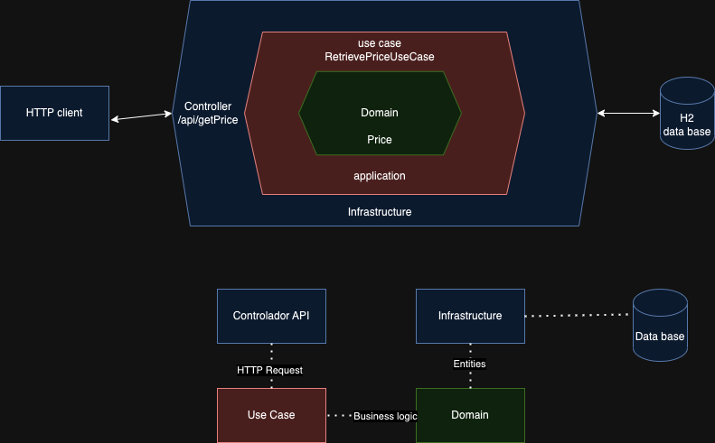

# Arquitectura hexagonal

Aquí se muestra el diagrama de arquitectura hexagonal del proyecto.



## Descripción

El proyecto es un microservicio en arquitectura hexagonal que provee servicio de API rest de los
precios de productos del grupo.

## Características

- Devuelve el precio de un producto para una marca del grupo en un rango de fecha determinado.
- Se utiliza la prioridad del mismo como filtro a aplicar en caso de coincidencia en el precio.

## Tecnologías Utilizadas

- Java 21
- Spring Boot
- Swagger/OpenAPI
- Lombok
- H2 Database

## Configuración del Entorno de Desarrollo

Asegúrate de tener instalado lo siguiente en tu máquina:

- Java JDK 17 o superior
- Maven 3.9.6

## Instalación

1. Clona este repositorio en tu máquina local.
2. Abre el proyecto en tu IDE de preferencia (Eclipse, IntelliJ, etc.).
3. Ejecuta `mvn clean install` para compilar y construir el proyecto.
4. Ejecuta la aplicación utilizando el comando `mvn spring-boot:run` o desde tu IDE.

## Uso

Para usar la aplicación, sigue estos pasos:

1. Abre un navegador web.
2. Ve a la URL [http://localhost:8080/swagger-ui.html](http://localhost:8080/swagger-ui.html) para
   acceder a la interfaz de Swagger.
3. Para acceder a la base de datos, utiliza [H2 Console](http://localhost:8080/h2-console) e inserta
   los datos de prueba. Por ejemplo:

```sql
INSERT INTO PRICES (BRAND_ID, START_DATE, END_DATE, PRICE_LIST, PRODUCT_ID, PRIORITY, PRICE, CURRENCY) VALUES
(1, '2020-06-14 00:00:00', '2020-12-31 23:59:59', 1, 35455, 0, 35.50, 'EUR'),
(1, '2020-06-14 15:00:00', '2020-06-14 18:30:00', 2, 35455, 1, 25.45, 'EUR'),
(1, '2020-06-15 00:00:00', '2020-06-15 11:00:00', 3, 35455, 1, 30.50, 'EUR'),
(1, '2020-06-15 16:00:00', '2020-12-31 23:59:59', 4, 35455, 1, 38.95, 'EUR');
```

Esto te permitirá insertar los datos de prueba en la tabla "PRICES".

4. Explora los endpoints disponibles y sus operaciones. Un ejemplo podrías añadir estos datos en la interfaz de swagger para probar
   `(applicationDate=2020-06-14T15:00:00, productId=35455, brandId=1)`
5. Prueba los diferentes endpoints enviando solicitudes HTTP a la API.

## Créditos

- Autor: Matías Deambrosi
- Email: info@matiasdeambrosi.com
- Repositorio: [URL del repositorio]

